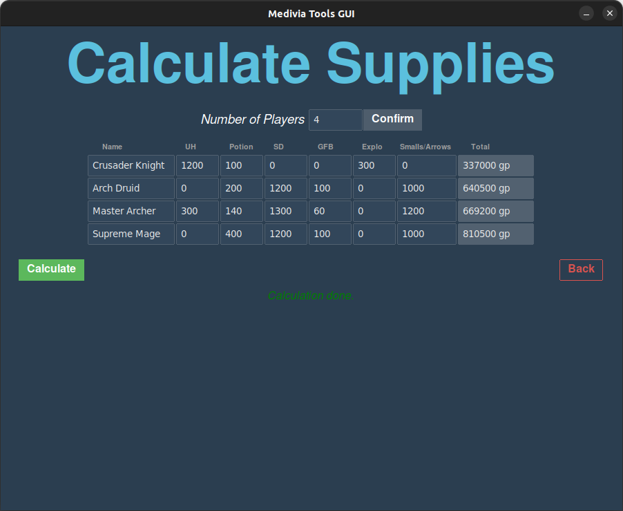

# Medivia Tools GUI

## What is Medivia Tools GUI?

**Medivia Tools GUI** is a fast and user-friendly desktop application for Medivia online players, providing essential utilities for organized group hunts, loot sharing, drop/skin probability calculations, and a quick item vendor lookup—all via a beautiful graphical interface!

## Features

### 1. 📦 Supplies Calculator

Easily calculate each player's total supply costs for group hunts.


### 2. 💰 Hunt Profit Divider

Split total loot equally and fairly—calculate how much each player should receive after accounting for waste.

### 3. 🛒 Where to Buy/Sell Items

Search for any item to instantly see which NPC buys/sells it and for how much.

### 4. 🎲 Drop/Skin Probability Calculator

Find the odds of getting rare drops or skins based on drop rate, kills, and quantity desired.

## Installation

### On Ubuntu / Linux

```bash
# 1. Make sure Python 3 and pip are installed
sudo apt update
sudo apt install python3 python3-pip

# 2. (Optional but recommended) Create and activate a virtual environment
python3 -m venv venv
source venv/bin/activate

# 3. Install dependencies
pip install ttkbootstrap

# 4. Download the project
git clone https://github.com/yourusername/medivia-tools-gui.git
cd medivia-tools-gui

# 5. Run the app
python3 mediviatools-gui.py
```


#### To create a standalone app (optional):

```bash
pip install pyinstaller
pyinstaller --hidden-import "PIL._tkinter_finder" --onefile --windowed mediviatools-gui.py
```


### On Windows

1. [Install Python 3.x](https://www.python.org/downloads/) (check "Add Python to PATH" during installation).
2. Open Windows Command Prompt or PowerShell.
3. Install required packages:

```
pip install ttkbootstrap
```

4. Download and extract the repo .zip or use Git:

```
git clone https://github.com/yourusername/medivia-tools-gui.git
cd medivia-tools-gui
```

5. Run the app:

```
python mediviatools-gui.py
```

6. *(Optional)* To build an `.exe`:

```
pip install pyinstaller
pyinstaller --hidden-import "PIL._tkinter_finder" --onefile --windowed mediviatools-gui.py
```

The `.exe` will appear in the `dist\` folder.

## Project Structure

- **mediviatools-gui.py** — Main Python source file (Tkinter + ttkbootstrap).
- **images/** — Screenshots for showcase.
- No internet or database required; all info local/offline.
